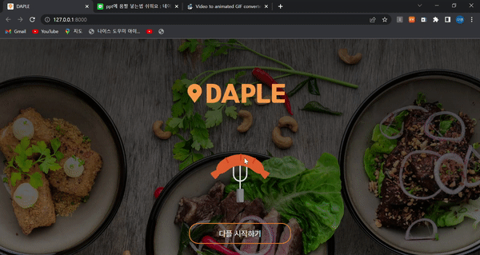
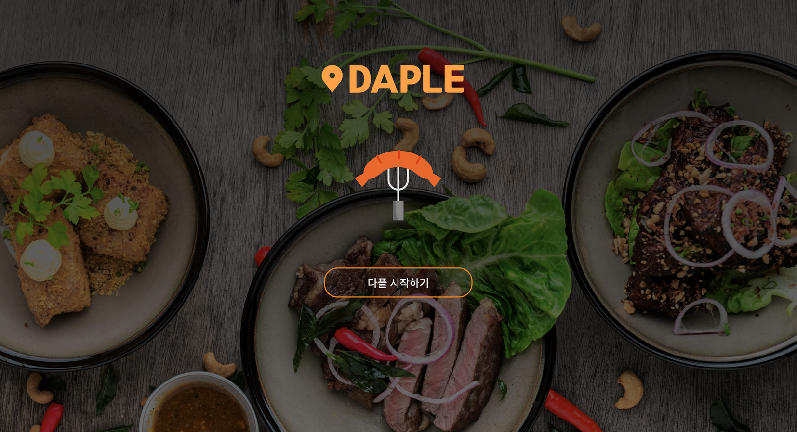
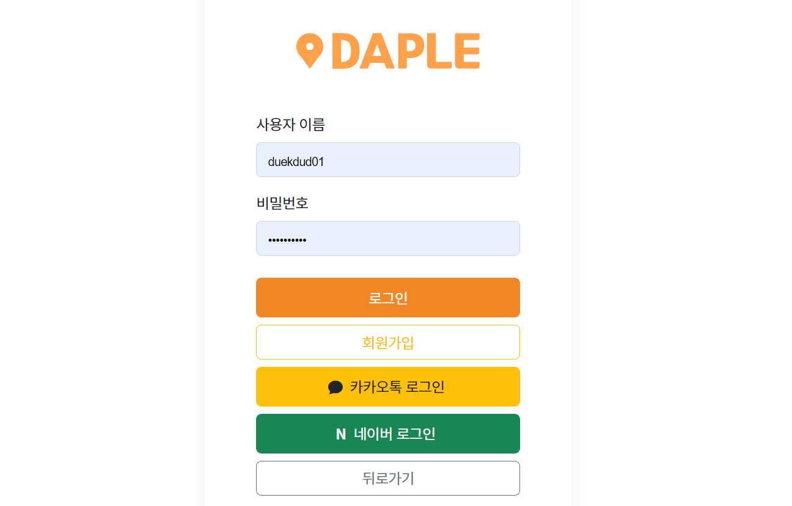
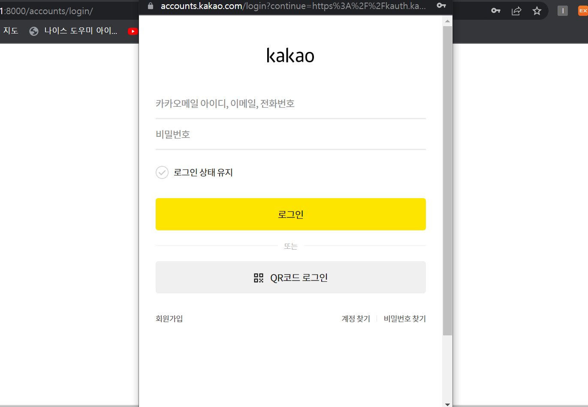
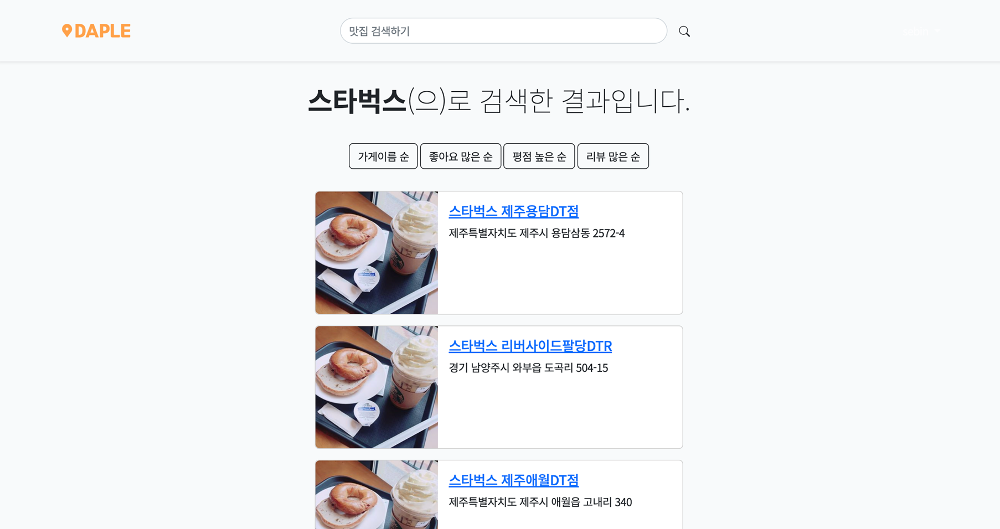

# 세빈이와 아이들🙋🏻‍♀️

 

## 🍽 다플 : 다이닝 플레이트

 

## 🍽 다플의 주요기능

#### **1.** **내 주변** **맛집** **소개 및 검색**

👉 ‘카카오맵 API’를 통한 위치 기반 크롤링

👉 가게명, 지역을 통한 맛집 검색

#### **2.** **리뷰를 통한** **커뮤니티 기능**

👉 필터링을 통한 좋아요 순, 리뷰 많은 순으로 맛집 보기

👉 리뷰 CRUD와 좋아요 기능, 팔로우 기능을 통한 정보 공유

 

## 🍽 다플 사이트 소개

#### [ 웰컴페이지 ]

- 웹사이트를 들어가면 가장 먼저 나오는 페이지
- 자바스크립트를 활용해 생동감 있게 구현

 

#### [ 메인페이지 ]

- 내 주변 맛집 찾기를 클릭하면

  - 지도에 현재 위치가 나타남
  - 현재 위치 주변의 맛집들이 나타남

  => ‘카카오맵 API’를 통한 위치 기반 크롤링

- 내 주변 맛집들이 '#분위기 있는'과 '#지역주민이 찾는' 태그로 분류됨

- 네브바와 업버튼, 푸터, 카드 hover 이미지 등 css 부분도 구현함

 

#### [ 회원가입 / 로그인 ]

- 회원가입과 로그인 기능 구현
- 소셜 로그인 기능도 추가로 구현 (네이버, 카카오)
  - all_auth를 사용하지 않고, 자바스크립트 API를 활용 후, 데이터베이스에 저장하는 로직을 짬

 

#### [ 마이페이지 ]

- 로그인 되었을 때, 볼 수 있는 마이페이지
- 기본적인 회원 정보와 작성한 리뷰, 댓글, 찜한 가게, 팔로워들을 볼 수 있음
- 정보 수정 및 회원 탈퇴가 가능함

 

#### [ 검색기능 ]

- 지역, 맛집 이름 을 통한 검색기능

  => 장고의 Q를 활용함

- 가게이름 순, 좋아요 많은 순 등으로 추가 필터링 구현

  => 비동기 방식을 활용함

 

## 🍽 AWS를 통한 배포

 

## ⚙️ Stacks

       

 

## 🍽 프로젝트 참여자들

 

## 🍽 프로젝트 후기

**최준우** : 운이 좋아 좋은 팀원분들을 만나서 일주일동안 크게 어려움없이 재밌게 진행한것 같습니다. 감사합니다. 

**윤효근** : 일주일을 하얗게 불태웠습니다. 고생한만큼 많이 배운것 같습니다. 팀원분들 사랑합니다. 

**권세빈** : 처음으로 일주일동안 프로젝트를 해보았는데 힘든 만큼 배우는 것도 많고 얻어가는게 많아서 좋았습니다. 

**여다영** : 일주일 동안 한다고 힘들었지만 너무 재미있었어요 ㅎㅎㅎ 세빈이와 아이들 짱🤍